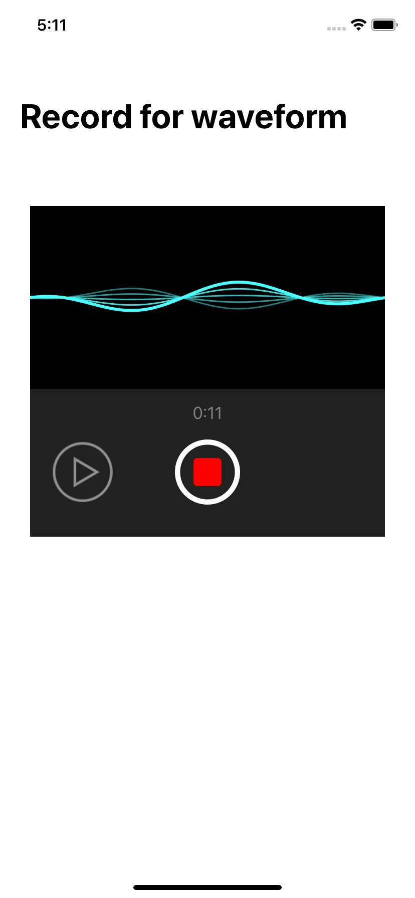
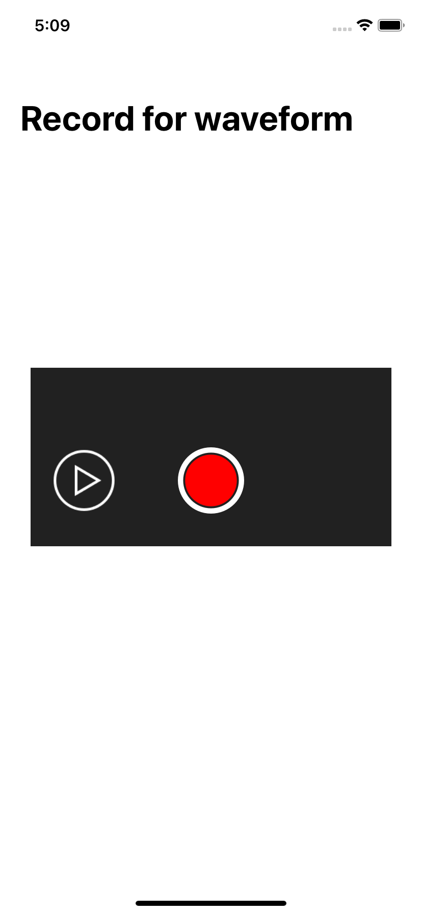
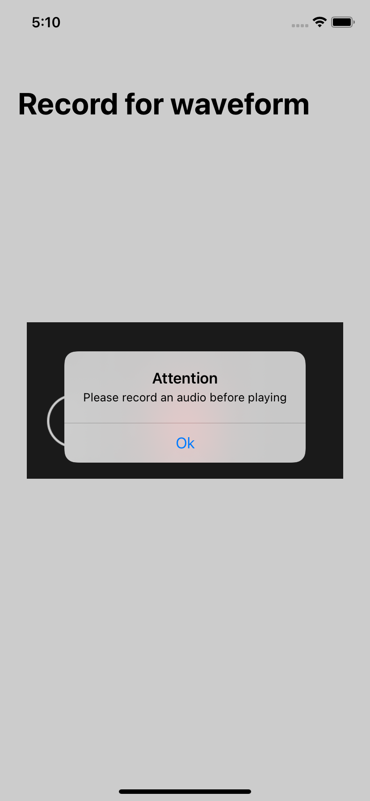

# ChiChi-VoiceRecorder

This is a voice recording application that uses an audio engine to record audio in a byte buffer and convert to .wav format before playing the file. Also, it shows a waveform presenting the amplitude of the voice being recorded in real time.

  

